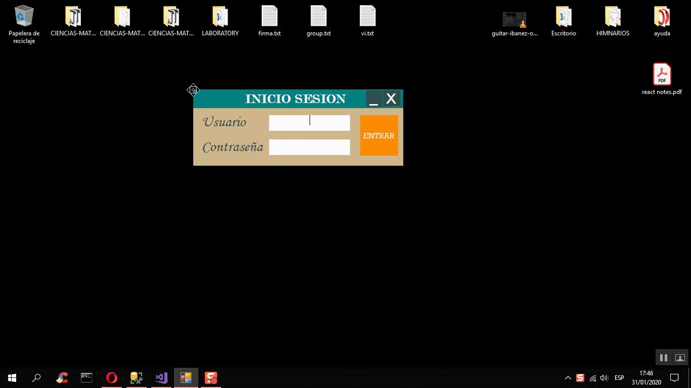

```bash
# El repositorio, junto a este archivo, es sólo muestra. 
# Todo el código y el repositorio original estan en privado.
```
# Laboratory - Demo


# Laboratory - Descripción del Proyecto
**Aplicación que desarrollé para el Med. Heber Pilco, egresado de la Universidad San Marcos, la cual cumple con las siguientes caracteristicas:**
- Registrar pacientes con sus respectivos resultados de sus examenes médicos (Repositorio adjunto).
- Visualizar el historial de cada paciente (Para obtener el proyecto completo favor de comunicarse con mi persona).
- Realizar un analisis general en el apartado Reportes (Para obtener el proyecto completo favor de comunicarse con mi persona).

# Laboratory - Inicialización

**Clona y ejecuta el programa para ver a Laboratory en uso**

## Pasos

Para clonar y ejecutar el proyecto necesitas instalar primero [Git](https://git-scm.com). Desde el terminal ingresa una por una las siguientes lineas:

```bash
# Clona este repositorio
git clone https://github.com/KeyCuevasMelgarejo/LABORATORY
# Abrir el archivo Laboratory.sql y ejecuta el script dentro de Microsoft SQL Server o puedes abrir los datos de prueba adjuntos  (Laboratory.mdf)
```
